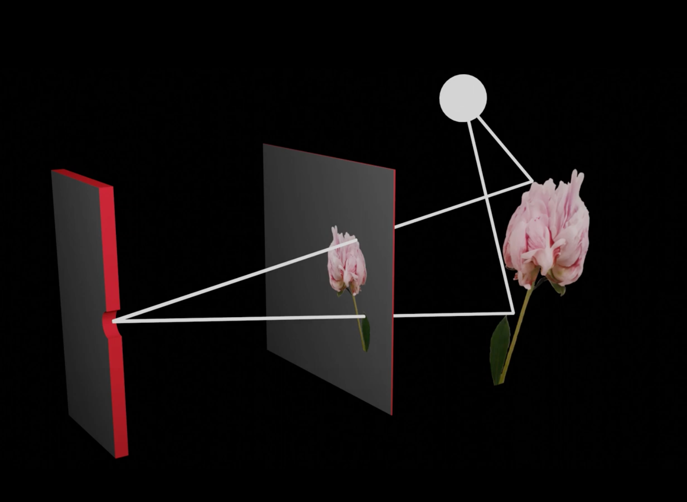
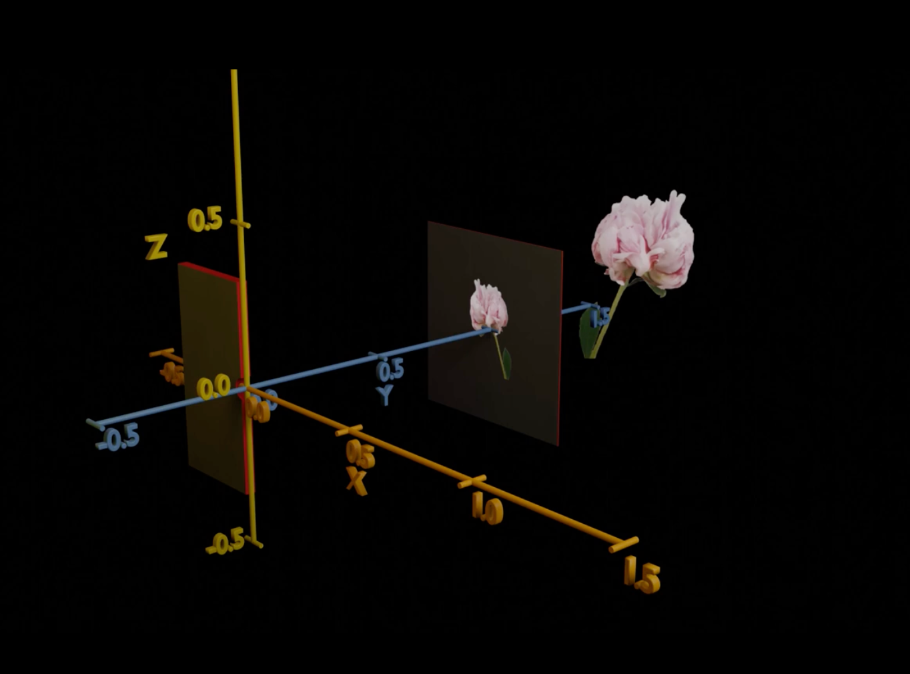
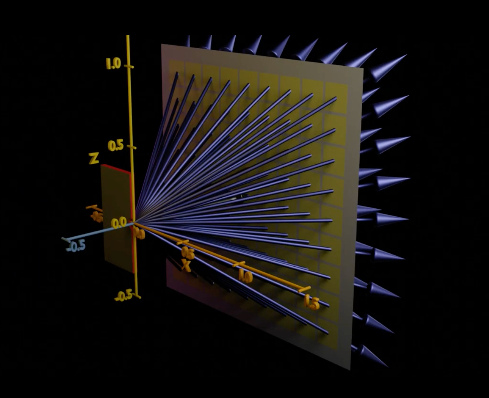
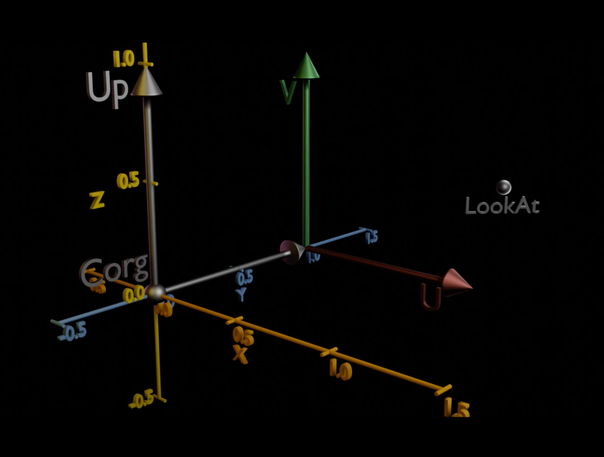

# RayTracing

## What is RayTracing

## Use SDL2 to create windows and write something on the surface.

## Camera









> 图像平面（Image Plane）是指在计算机图形学和计算机视觉领域中，虚拟摄像机在空间中生成图像的那个平面。它是场景中从三维到二维投影的平面，简单来说，就是摄像机所“看到”的东西最终映射到这个平面上形成的图像。

### 计算实例

- m_CameraPosition: 摄像机在世界坐标系中的位置，假设为 (0, 0, 0)
- m_CameraLookAt: 摄像机看向的目标点，假设为 (0, 0, -1)
- m_CameraUp: 摄像机的上方向向量，假设为 (0, 1, 0)
- m_CameraLength: 摄像机到图像平面的距离，假设为 1
- m_CameraHorizontalSize: 图像平面的水平尺寸，假设为 2
- m_CameraAspectRatio: 图像平面的长宽比，假设为 1 （意味着图像平面的垂直尺寸也为 2

```c++
// 图形平面计算
// 1. 计算摄像机朝向向量：
m_AlimentVector = m_CameraLookAt - m_CameraPosition 
                = (0, 0, -1) - (0, 0, 0) 
                = (0, 0, -1)
m_AlimentVector.Normalize() // 归一化后的向量仍为 (0, 0, -1)

// 2. 计算图像平面的 U 向量和 V 向量：
m_ProjectScreenU = cross(m_AlimentVector, m_CameraUp) 
                 = cross((0, 0, -1), (0, 1, 0)) 
                 = (1, 0, 0)
m_ProjectScreenU.Normalize() // 归一化后的向量仍为 (1, 0, 0)
m_ProjectScreenV = cross(m_ProjectScreenU, m_AlimentVector) 
                 = cross((1, 0, 0), (0, 0, -1)) 
                 = (0, 1, 0)
m_ProjectScreenV.Normalize() // 归一化后的向量仍为 (0, 1, 0)

// 3. 扩展向量的长度
m_ProjectScreenU = m_ProjectScreenU * m_CameraHorizontalSize 
                 = (1, 0, 0) * 2 
                 = (2, 0, 0)
m_ProjectScreenV = m_ProjectScreenV * (m_CameraHorizontalSize / m_CameraAspectRatio) 
                 = (0, 1, 0) * 2 
                 = (0, 2, 0)

// 4. 计算图像平面的中心点：
m_ProjectScreenCenter = m_CameraPosition + (m_CameraLength * m_AlimentVector) 
                      = (0, 0, 0) + (1 * (0, 0, -1)) 
                      = (0, 0, -1)
```
```c++
// 生成射线示例
// 假设要生成图像平面上归一化坐标为 (proScreenX, proScreenY) = (0.5, 0.5) 对应的射线。

// 1. 计算图像平面上的世界坐标：
screenWorldPart1 = m_ProjectScreenCenter + (m_ProjectScreenU * proScreenX)
                 = (0, 0, -1) + (2, 0, 0) * 0.5
                 = (0, 0, -1) + (1, 0, 0)
                 = (1, 0, -1)
screenWorldCoordinate = screenWorldPart1 + (m_ProjectScreenV * proScreenY)
                       = (1, 0, -1) + (0, 2, 0) * 0.5
                       = (1, 0, -1) + (0, 1, 0)
                       = (1, 1, -1)
// 2. 生成射线
RT::Ray(m_CameraPosition, screenWorldCoordinate)

// 该射线的起点为 (0, 0, 0)，
// 方向为从摄像机位置 (0, 0, 0) 指向图像平面上的坐标 (1, 1, -1) 的向量。
```