# RayTracing

## What is RayTracing

> 光线追踪（Ray Tracing）是一种图形渲染技术，用于生成高度逼真的图像。光线追踪模拟光线在场景中的传播和交互，以实现逼真的光照效果、阴影、反射、折射和全局光照。
>
> 光线追踪基于光的物理行为，通过追踪从视点出发的光线，与场景中的物体交互来模拟视觉效果


光线追踪算法是一种非常自然的技术，相比于光栅化的方法，它更加简单、暴力、真实。与光栅化根据物体计算所在的像素的方式不同，光线路径追踪的方法是一个相反的过程，它在于用眼睛去看世界而不是世界如何到达眼中。如下图所示，从视点出发向屏幕上每一个像素发出一条光线View Ray，追踪此光路并计算其逆向光线的方向，映射到对应的像素上。通过计算光路上颜色衰减和叠加，即可基本确定每一个像素的颜色。


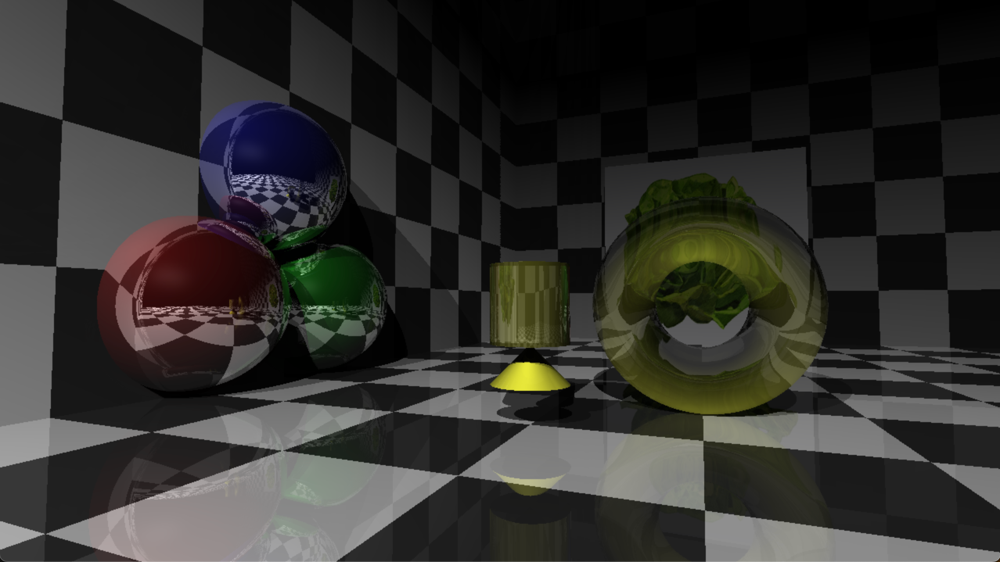


本次分享就是讲述如何通过光线追踪渲染出如图片效果

[参考学习的视频链接在这里](www.youtube.com/c/QuantitativeBytes)

## 窗口&代码

**使用 SDL2 创建窗口** + **Cmake组织 c++ 代码**

> SDL（Simple DirectMedia Layer）是一个跨平台的多媒体开发库，用于访问低级硬件（如图形、声音和输入设备）。

> CMake 是一个跨平台的开源构建系统，它被设计用来管理复杂的软件构建过程。CMake 使用名为 CMakeLists.txt 的配置文件来生成原生的构建工具文件（如 Makefile 或项目文件），从而使开发者可以使用自己熟悉的构建工具。

## Camera （摄像机）


**摄像机位置（Camera Position）**：摄像机在世界坐标系中的位置，记为 $\mathbf{Corg}$。
**看向的位置（Look At Position）**：摄像机所望向的点，记为 $\mathbf{LookAt}$。
**上方向向量（Up Vector）**：定义摄像机的上方向，记为 $\mathbf{Up}$。
**焦距（Focal Length）**：从摄像机到投影平面的距离，记为 $f$。
**投影平面的尺寸**：水平尺寸 $W$ 和垂直尺寸 $H$。
**宽高比（Aspect Ratio）**：投影平面宽度与高度的比值，记为 $\text{AR}$。
例如，宽高比为 16:9，则 $\text{AR} = 16/9$。


> 向量计算
> 
1. **对齐向量（Forward Vector）**：从摄像机位置指向看向点的单位向量，表示摄像机的朝向。
$$
\mathbf{F} = \frac{\mathbf{LookAt} - \mathbf{Corg}}{|\mathbf{LookAt} - \mathbf{Corg}|}
$$

2. **水平向量（Right Vector）**：摄像机水平方向，由对齐向量和上方向向量的叉积得到。
$$
\mathbf{U} = \frac{\mathbf{F} \times \mathbf{Up}}{|\mathbf{F} \times \mathbf{Up}|}
$$

3. **直向量（Up Vector）**：由水平向量和对齐向量的叉积得到，重新计算后的上方向向量。
$$
\mathbf{V} = \mathbf{U} \times \mathbf{F}
$$

> 平面计算

1. **投影平面中心点**：从摄像机位置沿对齐向量方向前进焦距的点，表示投影平面的中心。
$$
\mathbf{P}_\text{center} = \mathbf{Corg} + f \mathbf{F}
$$

2. **投影平面的尺寸调整**：
$$
\mathbf{U}_\text{plane} = \mathbf{U} \times W
$$
$$
\mathbf{V}_\text{plane} = \mathbf{V} \times H
$$

> U 和 V 向量确实定义了投影屏平面，并且这个平面是与由 Up 向量和 Alignment 向量 (m_alignmentVector) 形成的平面是垂直的。

> 图像平面（Image Plane）是指在计算机图形学和计算机视觉领域中，虚拟摄像机在空间中生成图像的那个平面。它是场景中从三维到二维投影的平面，简单来说，就是摄像机所“看到”的东西最终映射到这个平面上形成的图像。

### 计算实例

- m_CameraPosition: 摄像机在世界坐标系中的位置，假设为 (0, 0, 0)
- m_CameraLookAt: 摄像机看向的目标点，假设为 (0, 0, -1)
- m_CameraUp: 摄像机的上方向向量，假设为 (0, 1, 0)
- m_CameraLength: 摄像机到图像平面的距离，假设为 1
- m_CameraHorizontalSize: 图像平面的水平尺寸，假设为 2
- m_CameraAspectRatio: 图像平面的长宽比，假设为 1 （意味着图像平面的垂直尺寸也为 2

```c++
// 图形平面计算
// 1. 计算摄像机朝向向量：
m_AlimentVector = m_CameraLookAt - m_CameraPosition 
                = (0, 0, -1) - (0, 0, 0) 
                = (0, 0, -1)
m_AlimentVector.Normalize() // 归一化后的向量仍为 (0, 0, -1)

// 2. 计算图像平面的 U 向量和 V 向量：
m_ProjectScreenU = cross(m_AlimentVector, m_CameraUp) 
                 = cross((0, 0, -1), (0, 1, 0)) 
                 = (1, 0, 0)
m_ProjectScreenU.Normalize() // 归一化后的向量仍为 (1, 0, 0)
m_ProjectScreenV = cross(m_ProjectScreenU, m_AlimentVector) 
                 = cross((1, 0, 0), (0, 0, -1)) 
                 = (0, 1, 0)
m_ProjectScreenV.Normalize() // 归一化后的向量仍为 (0, 1, 0)

// 3. 扩展向量的长度
m_ProjectScreenU = m_ProjectScreenU * m_CameraHorizontalSize 
                 = (1, 0, 0) * 2 
                 = (2, 0, 0)
m_ProjectScreenV = m_ProjectScreenV * (m_CameraHorizontalSize / m_CameraAspectRatio) 
                 = (0, 1, 0) * 2 
                 = (0, 2, 0)

// 4. 计算图像平面的中心点：
m_ProjectScreenCenter = m_CameraPosition + (m_CameraLength * m_AlimentVector) 
                      = (0, 0, 0) + (1 * (0, 0, -1)) 
                      = (0, 0, -1)
```
```c++
// 生成射线示例
// 假设要生成图像平面上归一化坐标为 (proScreenX, proScreenY) = (0.5, 0.5) 对应的射线。

// 1. 计算图像平面上的世界坐标：
screenWorldPart1 = m_ProjectScreenCenter + (m_ProjectScreenU * proScreenX)
                 = (0, 0, -1) + (2, 0, 0) * 0.5
                 = (0, 0, -1) + (1, 0, 0)
                 = (1, 0, -1)
screenWorldCoordinate = screenWorldPart1 + (m_ProjectScreenV * proScreenY)
                       = (1, 0, -1) + (0, 2, 0) * 0.5
                       = (1, 0, -1) + (0, 1, 0)
                       = (1, 1, -1)
// 2. 生成射线
RT::Ray(m_CameraPosition, screenWorldCoordinate)

// 该射线的起点为 (0, 0, 0)，
// 方向为从摄像机位置 (0, 0, 0) 指向图像平面上的坐标 (1, 1, -1) 的向量。
```

## GETR(几何变换)

- In general, a geometric transform can be defined as:

$$
\begin{bmatrix}
\hat{v}_1 \\
\hat{v}_2 \\
\hat{v}_3
\end{bmatrix}
=\begin{bmatrix}
a_{11} & a_{12} & a_{13} \\
a_{21} & a_{22} & a_{23} \\
a_{31} & a_{32} & a_{33}
\end{bmatrix}
\begin{bmatrix}
v_1 \\
v_2 \\
v_3
\end{bmatrix}
$$

- Where the matrix \( \mathbf{A} \) defines the transform that is applied to the vector \( \vec{v} \) to give \( \hat{\vec{v}} \).

- But, how do we calculate the values of \( a_{11} \) through \( a_{33} \) that we need to achieve the transform that we want?

### The simplest case - The identity matrix

- Let's consider the simplest case first, where \(\mathbf{A}\) is simply the identity matrix.

  $$
  \begin{bmatrix}
  \hat{v}_1 \\
  \hat{v}_2 \\
  \hat{v}_3
  \end{bmatrix}
  =\begin{bmatrix}
  1 & 0 & 0 \\
  0 & 1 & 0 \\
  0 & 0 & 1
  \end{bmatrix}
  \begin{bmatrix}
  v_1 \\
  v_2 \\
  v_3
  \end{bmatrix}
  $$

- Of course, this simplifies to:

  $$
  \begin{aligned}
  \hat{v}_1 &= v_1 \\
  \hat{v}_2 &= v_2 \\
  \hat{v}_3 &= v_3
  \end{aligned}
  $$

### Scaling

- If we change the diagonal values to be something other than 1 we can show that this would represent a _scaling_:

  $$
  \begin{bmatrix}
  \hat{v}_1 \\
  \hat{v}_2 \\
  \hat{v}_3
  \end{bmatrix}=
  \begin{bmatrix}
  a_{11} & 0 & 0 \\
  0 & a_{22} & 0 \\
  0 & 0 & a_{33}
  \end{bmatrix}
  \begin{bmatrix}
  v_1 \\
  v_2 \\
  v_3
  \end{bmatrix}
  $$

- Now this equations to:

  $$
  \begin{aligned}
  \hat{v}_1 &= a_{11} v_1 \\
  \hat{v}_2 &= a_{22} v_2 \\
  \hat{v}_3 &= a_{33} v_3
  \end{aligned}
  $$

- So the values \(a_{11}\), \(a_{22}\) and \(a_{33}\) define a scaling in each of the three axes.

### Rotation

- Ok, so _scaling_ is easy, but what about other transforms such as _rotation_?
- Let’s look at rotation in just two dimensions to start with. A two-dimensional vector can be rotated using:

  $$
  \begin{bmatrix}
  \hat{v}_1 \\
  \hat{v}_2
  \end{bmatrix}=
  \begin{bmatrix}
  \cos \theta & -\sin \theta \\
  \sin \theta & \cos \theta
  \end{bmatrix}
  \begin{bmatrix}
  v_1 \\
  v_2
  \end{bmatrix}
  $$

- Which equates to:

  $$
  \begin{aligned}
  \hat{v}_1 &= v_1 \cos \theta - v_2 \sin \theta \\
  \hat{v}_2 &= v_1 \sin \theta + v_2 \cos \theta
  \end{aligned}
  $$

  Where \( \theta \) is the angle of the rotation.
- This will rotate the original vector \( \vec{v} \) about the origin to give the new vector \( \hat{\vec{v}} \).


- So, we need to compute the rotation about each axis, \( \theta_x \), \( \theta_y \) and \( \theta_z \) in turn.
- To form each matrix, we only need to think about the 2D case that we saw before and the particular axis that we wish to rotate about. So, the 2D rotation matrix we saw before was:

  $$
  \begin{bmatrix}
  \cos \theta & -\sin \theta \\
  \sin \theta & \cos \theta 
  \end{bmatrix}
  $$

- To rotate about the \( x \) axis by \( \theta_x \), we wish to keep the \( x \) axis constant, so we can form the transform matrix as:

  $$
  \mathbf{A}_x =
  \begin{bmatrix}
  1 & 0 & 0 \\
  0 & \cos \theta_x & -\sin \theta_x \\
  0 & \sin \theta_x & \cos \theta_x 
  \end{bmatrix}
  $$

- Notice that this is just the 2D rotation matrix superimposed onto the identity matrix such that the first element, \( a_{11} \), is left unchanged.

- And the other two axes are similar, giving:

  $$
  \mathbf{A}_x =
  \begin{bmatrix}
  1 & 0 & 0 \\
  0 & \cos \theta_x & -\sin \theta_x \\
  0 & \sin \theta_x & \cos \theta_x 
  \end{bmatrix}
  $$

  $$
  \mathbf{A}_y =
  \begin{bmatrix}
  \cos \theta_y & 0 & \sin \theta_y \\
  0 & 1 & 0 \\
  -\sin \theta_y & 0 & \cos \theta_y
  \end{bmatrix}
  $$

  $$
  \mathbf{A}_z =
  \begin{bmatrix}
  \cos \theta_z & -\sin \theta_z & 0 \\
  \sin \theta_z & \cos \theta_z & 0 \\
  0 & 0 & 1
  \end{bmatrix}
  $$

- Ok, so that’s not too bad. But what if I want to rotate about more than just one axis at a time?
- Luckily, we can combine the transform matrices together by simply taking the matrix product. So, our complete rotation, in all three axes, would be given by:

  $$
  \mathbf{A} = \mathbf{A}_z(\theta_z) \mathbf{A}_y(\theta_y) \mathbf{A}_x(\theta_x)
  $$

  $$
  \mathbf{A} =
  \begin{bmatrix}
  \cos \theta_z & -\sin \theta_z & 0 \\
  \sin \theta_z & \cos \theta_z & 0 \\
  0 & 0 & 1
  \end{bmatrix}
  \begin{bmatrix}
  \cos \theta_y & 0 & \sin \theta_y \\
  0 & 1 & 0 \\
  -\sin \theta_y & 0 & \cos \theta_y
  \end{bmatrix}
  \begin{bmatrix}
  1 & 0 & 0 \\
  0 & \cos \theta_x & -\sin \theta_x \\
  0 & \sin \theta_x & \cos \theta_x
  \end{bmatrix}
  $$

- What makes this method so powerful is actually the way that we can combine transforms together into a single transformation matrix.
- So, we can combine scaling with rotation in just the same way:

  $$
  \mathbf{A} = 
  \begin{bmatrix}
  s_x & 0 & 0 \\
  0 & s_y & 0 \\
  0 & 0 & s_z
  \end{bmatrix}
  \begin{bmatrix}
  \cos \theta_z & -\sin \theta_z & 0 \\
  \sin \theta_z & \cos \theta_z & 0 \\
  0 & 0 & 1
  \end{bmatrix}
  \begin{bmatrix}
  \cos \theta_y & 0 & \sin \theta_y \\
  0 & 1 & 0 \\
  -\sin \theta_y & 0 & \cos \theta_y
  \end{bmatrix}
  \begin{bmatrix}
  1 & 0 & 0 \\
  0 & \cos \theta_x & -\sin \theta_x \\
  0 & \sin \theta_x & \cos \theta_x
  \end{bmatrix}
  $$

- In which case the new vector, \( \hat{\vec{v}} \) would be:

  $$
  \hat{\vec{v}} = \mathbf{A} \vec{v}
  $$

- This would rotate \( \vec{v} \) by \( \theta_z \), then by \( \theta_y \), then by \( \theta_x \) and finally apply the scaling.

### Translation

- But wait! What about translation?
- Good question! To translate a vector by another vector, we simply add them together.

  $$
  \begin{bmatrix}
  \hat{v}_1 \\
  \hat{v}_2 \\
  \hat{v}_3
  \end{bmatrix}=
  \begin{bmatrix}
  v_1 \\
  v_2 \\
  v_3
  \end{bmatrix}
  +
  \begin{bmatrix}
  t_x \\
  t_y \\
  t_z
  \end{bmatrix}
  $$

- Giving:

  $$
  \begin{aligned}
  \hat{v}_1 &= v_1 + t_x \\
  \hat{v}_2 &= v_2 + t_y \\
  \hat{v}_3 &= v_3 + t_z
  \end{aligned}
  $$

- That’s easy enough, but we want to be able to combine all of our transforms together into a single matrix. How can we do that for translation?

- There is a way that we can combine translation with the other transforms, using **homogeneous coordinates(齐次坐标)**.
- To do this, we need to add an extra element to our vector \( \vec{v} \), which then becomes:

  $$
  \vec{v} =
  \begin{bmatrix}
  v_1 \\
  v_2 \\
  v_3 \\
  1
  \end{bmatrix}
  $$

- And, we modify our transform matrices in a similar way to make them \( 4 \times 4 \):

  $$
  \mathbf{A} =
  \begin{bmatrix}
  a_{11} & a_{12} & a_{13} & 0 \\
  a_{21} & a_{22} & a_{23} & 0 \\
  a_{31} & a_{32} & a_{33} & 0 \\
  0 & 0 & 0 & 1
  \end{bmatrix}
  $$

- Let's ignore any other transforms for now and work this through for a pure translation:

  $$
  \begin{bmatrix}
  \hat{v}_1 \\
  \hat{v}_2 \\
  \hat{v}_3 \\
  1
  \end{bmatrix}=
  \begin{bmatrix}
  1 & 0 & 0 & t_x \\
  0 & 1 & 0 & t_y \\
  0 & 0 & 1 & t_z \\
  0 & 0 & 0 & 1
  \end{bmatrix}
  \begin{bmatrix}
  v_1 \\
  v_2 \\
  v_3 \\
  1
  \end{bmatrix}
  $$

  $$
  \begin{aligned}
  \hat{v}_1 &= v_1 + 0v_2 + 0v_3 + t_x \\
  \hat{v}_2 &= 0v_1 + v_2 + 0v_3 + t_y \\
  \hat{v}_3 &= 0v_1 + 0v_2 + v_3 + t_z
  \end{aligned}
  $$

### Combined transforms

- Now, we can combine all of our transforms together if we express them in homogenous coordinates:

  $$
  \mathbf{S}(x, y, z) = 
  \begin{bmatrix}
  s_x & 0 & 0 & 0 \\
  0 & s_y & 0 & 0 \\
  0 & 0 & s_z & 0 \\
  0 & 0 & 0 & 1
  \end{bmatrix}, \quad
  \mathbf{T}(x, y, z) = 
  \begin{bmatrix}
  1 & 0 & 0 & t_x \\
  0 & 1 & 0 & t_y \\
  0 & 0 & 1 & t_z \\
  0 & 0 & 0 & 1
  \end{bmatrix}
  $$

  $$
  \mathbf{R}_x =
  \begin{bmatrix}
  1 & 0 & 0 & 0 \\
  0 & \cos \theta_x & -\sin \theta_x & 0 \\
  0 & \sin \theta_x & \cos \theta_x & 0 \\
  0 & 0 & 0 & 1
  \end{bmatrix}, \quad
  \mathbf{R}_y =
  \begin{bmatrix}
  \cos \theta_y & 0 & \sin \theta_y & 0 \\
  0 & 1 & 0 & 0 \\
  -\sin \theta_y & 0 & \cos \theta_y & 0 \\
  0 & 0 & 0 & 1
  \end{bmatrix}
  $$

  $$
  \mathbf{R}_z =
  \begin{bmatrix}
  \cos \theta_z & -\sin \theta_z & 0 & 0 \\
  \sin \theta_z & \cos \theta_z & 0 & 0 \\
  0 & 0 & 1 & 0 \\
  0 & 0 & 0 & 1
  \end{bmatrix}
  $$

- And we can combine these together into a single transform matrix:

  $$
  \mathbf{A} = \mathbf{T}(x, y, z) \mathbf{S}(x, y, z) \mathbf{R}_x \mathbf{R}_y \mathbf{R}_z
  $$

- And our new vector can be found simply by:

  $$
  \hat{\vec{v}} = \mathbf{A} \vec{v}
  $$

- What’s great about this is that we can recover \( \vec{v} \) from \( \hat{\vec{v}} \) quite simply by multiplying by the inverse of \( \mathbf{A} \):

  $$
  \vec{v} = \mathbf{A}^{-1} \hat{\vec{v}}
  $$

目前定义的球体


有了变换就可以将球体的物理坐标转换为世界坐标，
> 在3D图形学中，通常我们有一个物体的局部坐标系（例如球体的物理坐标），然后通过一系列变换（平移、旋转、缩放等），将该物体从局部坐标系转换到世界坐标系中。


## Plane & Shadows （平面与阴影）


### 平面交点推导

**平面的方程：**
$$
\vec{x} = \vec{p_0} + \vec{p}_{01} u + \vec{p}_{02} v
$$

其中，$\vec{p}_0$ 是平面上的一个点。$\vec{p}_{01}$ 和 $\vec{p}_{02}$ 是平面上两个方向向量。$u$ 和 $v$ 是标量参数。

**直线的方程：**

$$
\vec{l} = \vec{a} + t \vec{k}
$$

其中，$\vec{a}$ 是直线上的一个点。$\vec{k}$ 是直线的方向向量。$t$ 是标量参数。

**交点：**
在交点处，坐标必须同时满足平面的方程和直线的方程。因此：
$$
\vec{a} + t \vec{k} = \vec{p}_0 + \vec{p}_{01} u + \vec{p}_{02} v
$$

**矩阵形式：**
通过重排方程，可以将 $\vec{a}$ 表示为方向向量和参数的组合：
$$
\vec{a} = \begin{bmatrix}
   -\vec{k} & \vec{p}_{01} & \vec{p}_{02}
\end{bmatrix}
\begin{bmatrix}
    t \\
    u \\
    v
\end{bmatrix}
$$

这个公式给出了包含三个未知数 $t$，$u$ 和 $v$ 的三元线性方程组，通过求解这个方程组可以找到直线与平面的确切交点。

我们将所有对象定义在它们自己的局部坐标系中。
这意味着我们可以将平面固定在 $XY$ 平面上，并将其中心放在原点。

因此，我们可以定义：

$$
\vec{p}_0 = \begin{bmatrix} 0 \\ 0 \\ 0 \end{bmatrix}
$$

$$
\vec{p}_{01} = \begin{bmatrix} 1 \\ 0 \\ 0 \end{bmatrix}
$$

$$
\vec{p}_{02} = \begin{bmatrix} 0 \\ 1 \\ 0 \end{bmatrix}
$$

我们可以重新写出交点方程为：

$$
\vec{a} = u \begin{bmatrix} 1 \\ 0 \\ 0 \end{bmatrix} + v \begin{bmatrix} 0 \\ 1 \\ 0 \end{bmatrix} - t\vec{k}
$$

或者分量形式表达为：
$$
\begin{align*}
a_x &= u - k_x t\\
a_y &= v - k_y t\\
a_z &= -k_z t
\end{align*}
$$

因此，可以解出：
$$
t = \frac{a_z}{-k_z}
$$

一旦我们知道 $t$，我们就可以将其代入直线的方程中：
$$
\vec{l} = \vec{a} + t \vec{k}
$$

这里，$\vec{l}$ 现在将是直线和平面的交点。
我们也可以很容易地计算出 $u$ 和 $v$ 的值：
$$
\begin{align*}
u &= a_x + k_x t\\
v &= a_y + k_y t
\end{align*}
$$

$u$ 和 $v$ 的值在后面会展现出其非常有用的性质。

### shadow

1. 初次光线投射（Primary Ray Casting）:
首先，从相机位置发射初始光线。每条光线穿过屏幕上的一个像素，并与场景中的物体进行相交测试，找到最近的交点。这一步用来判断光线击中了什么物体。

2. 阴影光线投射（Shadow Ray Casting）:
当确定初始光线与某个物体相交后，需要计算该点是否处于阴影中。为此，从交点向场景中的每个光源发射阴影光线。

3. 计算阴影光线: 从交点（Intersection Point）向光源发出一条光线（Shadow Ray）。
检测遮挡物: 检查阴影光线在其路径上是否与其他物体相交。如果有物体阻挡了这条光线，则交点处于阴影之中，意味着该点不能直接受到光照。

> 如果阴影光线到达光源时没有遇到任何遮挡物，则该点直接受到光照，可以继续计算光照贡献（包括直接光照和反射光照）。
如果阴影光线被遮挡，则认为该点处于阴影中，来自该光源的光不会对该点产生直接光照。

todo: 代码在哪？忘了

## Ray - Sphere Intersections（光线-球体🍌）


图中公式表示了光线的参数方程：

$$
\vec{x} = \vec{p_1} + t \vec{v}
$$

其中：

$\vec{p_1}$ 是光线的起点（或起点坐标 $(p_{1x}, p_{1y}, p_{1z})$)。
$\vec{v}$ 是光线方向单位向量 $(v_x, v_y, v_z)$。
$t$ 是参数（标量）。

假设球体的中心在 $\vec{C}$ 位置，半径为 $R$，则球体的方程可以表示为：

$$
|\vec{x} - \vec{C}|^2 = R^2
$$

为了找到交点，需要求解这个方程。我们可以将光线方程带入球体方程，如前面的推导所示：

$$
|\vec{p_1} + t\vec{v} - \vec{C}|^2 = R^2
$$

这展开后会成为一个二次方程：

$$
\left( \vec{v} \cdot \vec{v} \right) t^2 + 2 \left( \vec{v} \cdot (\vec{p_1} - \vec{C}) \right) t + \left( \vec{p_1} - \vec{C} \right) \cdot \left( \vec{p_1} - \vec{C} \right) - R^2 = 0
$$

记 $\vec{L} = \vec{p_1} - \vec{C}$，其中 $\vec{L}$ 是光线起点到球体中心的向量，则上述方程可以简化为：

$$
\left( \vec{v} \cdot \vec{v} \right) t^2 + 2 \left( \vec{L} \cdot \vec{v} \right) t + \left( \vec{L} \cdot \vec{L} \right) - R^2 = 0
$$

为了方便计算，我们求解的是在圆心在坐标轴心的单位球，则上述方程就能简化为

$$
t^2 + 2 \cdot \vec{p_1} \cdot t + \vec{p_1} \cdot \vec{p_1} - 1 = 0
$$

求解这个标准的二次方程 $at^2 + bt + c = 0$，其中：

$$
\begin{align*}
a &= \vec{v} \cdot \vec{v} = 1 \\
b &= 2 (\vec{L} \cdot \vec{v}) = 2 \cdot \vec{p_1} \cdot \vec{v} \\
c &= \left( \vec{L} \cdot \vec{L} \right) - R^2 = \vec{p_1} \cdot \vec{p_1} - 1
\end{align*}
$$


可以使用二次方程求根公式：

$$
t = \frac{-b \pm \sqrt{b^2 - 4ac}}{2a}
$$

带入具体的系数 $(a, b, c)$：

$$
t = \frac{-2 \cdot \vec{p_1} \pm \sqrt{(2 \cdot \vec{p_1})^2 - 4(\vec{p_1} \cdot \vec{p_1} - 1)}}{2}
$$

## Cone and Cylinder

如果我们能够为物体的表面形成适当的数学表达式，我们可以在光线追踪器中实现任何形状。
这些表达式将以 $x, y$ 和 $z$ 为变量，表示表面上的点。
我们可以使用直线的方程（我们的光线投射到场景中）表示如下：
$$
\begin{bmatrix}
x \\
y \\
z
\end{bmatrix} =
\begin{bmatrix}
p_x \\
p_y \\
p_z
\end{bmatrix} + t
\begin{bmatrix}
v_x \\
v_y \\
v_z
\end{bmatrix}
$$

这将给出 $x, y$ 和 $z$ 以 $t$ 为变量的表达式：
$$
\begin{aligned}
x = p_x + t v_x\\
y = p_y + t v_y\\
z = p_z + t v_z
\end{aligned}
$$

我们将这些表达式代入表面的方程中并求解 $t$。
然后我们使用这个 $t$ 的值，与原始的直线方程结合起来，确定交点的位置。


得到交点方程

$$
(p_x + t v_x)^2 + (p_y + t v_y)^2 = r^2
$$

展开公式

$$
t^2 v_x^2 + 2 p_x v_x t + p_x^2 + t^2 v_y^2 + 2 p_y v_y t + p_y^2 = r^2
$$

合并同类项

$$
t^2 v_x^2 + t^2 v_y^2 + 2 p_x v_x t + 2 p_y v_y t + p_x^2 + p_y^2 = r^2
$$

提出参数

$$
t^2 (v_x^2 + v_y^2) + 2t (p_x v_x + p_y v_y) + (p_x^2 + p_y^2) = r^2
$$

根据 

$$
at^2 + bt + c = 0
$$

推导出

$$
\begin{align*}
a &= v_x^2 + v_y^2\\
b &= 2(p_xv_x + p_yv_y)\\
c &= p_x^2 + p_y^2 -r^2\\
\end{align*}
$$

根据求根公式

$$ t = \frac{-B \pm \sqrt{B^2 - 4AC}}{2A} $$


因此，我们可以像之前处理球体和平面一样使用这个方法。
当我们进行相交测试时，我们首先从全局坐标系中的投射光线 $r$ 开始。

然后我们将这个光线变换到物体的局部坐标系中：
$$
\hat{r} = \mathbf{T}^{-1} r
$$

这里，$\mathbf{T}$ 是物体定义的前向变换，$\mathbf{T}^{-1}$ 是其逆变换。

我们可以使用刚才描述的过程来测试相交，从而得到相交点在局部坐标系中的表示 $p_{poi_{local}}$。

最后，我们将这个点变换回全局坐标系：
$$
p_{poi_{global}} = \mathbf{T} p_{poi_{local}}
$$


我们采用与圆柱体相交相同的方法进行测试：
$$
(px + tv_x)^2 + (py + tv_y)^2 = (pz + tv_z)^2
$$

展开并整理方程：

$$
t^2 v_x^2 + 2t p_x v_x + p_x^2 + t^2 v_y^2 + 2t p_y v_y + p_y^2 - t^2 v_z^2 - 2t p_z v_z - p_z^2 = 0
$$

合并相同次数的项：

$$
t^2 (v_x^2 + v_y^2 - v_z^2) + 2t (p_x v_x + p_y v_y - p_z v_z) + p_x^2 + p_y^2 - p_z^2 = 0
$$

这个方程形式为：

$$
t = \frac{-b \pm \sqrt{b^2 - 4ac}}{2a}
$$

其中：

$$
\begin{aligned}
a &= v_x^2 + v_y^2 - v_z^2\\
b &= 2(p_x v_x + p_y v_y - p_z v_z)\\
c &= p_x^2 + p_y^2 - p_z^2
\end{aligned}
$$


## box(盒子)

由[平面推导](#平面交点推导)，我们已知了面与光线的🍌法则

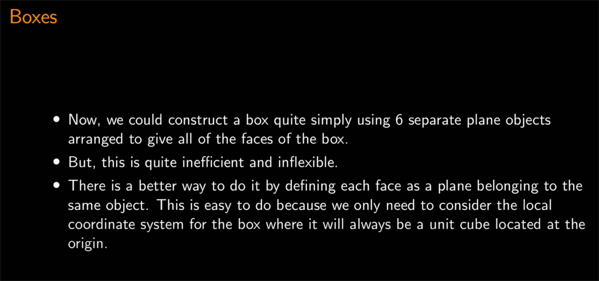

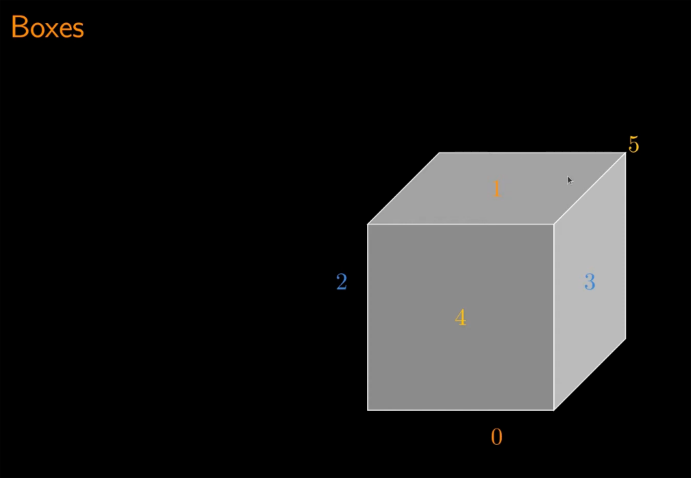

| Plane | $\vec{p}_0$ | $\vec{p}_{01}$ | $\vec{p}_{02}$ |
|-------|-------------|----------------|----------------|
| 0     | $\left[ \begin{array}{c} 0 \ 0 \ 1 \end{array} \right]^{T}$ | $\left[ \begin{array}{c} 1 \ 0 \ 0 \end{array} \right]^{T}$ | $\left[ \begin{array}{c} 0 \ 1 \ 0 \end{array} \right]^{T}$ |
| 1     | $\left[ \begin{array}{c} 0 \ 0 \ -1 \end{array} \right]^{T}$ | $\left[ \begin{array}{c} 1 \ 0 \ 0 \end{array} \right]^{T}$ | $\left[ \begin{array}{c} 0 \ 1 \ 0 \end{array} \right]^{T}$ |
| 2     | $\left[ \begin{array}{c} -1 \ 0 \ 0 \end{array} \right]^{T}$ | $\left[ \begin{array}{c} 0 \ 0 \ -1 \end{array} \right]^{T}$ | $\left[ \begin{array}{c} 0 \ 1 \ 0 \end{array} \right]^{T}$ |
| 3     | $\left[ \begin{array}{c} 1 \ 0 \ 0 \end{array} \right]^{T}$ | $\left[ \begin{array}{c} 0 \ 0 \ -1 \end{array} \right]^{T}$ | $\left[ \begin{array}{c} 0 \ 1 \ 0 \end{array} \right]^{T}$ |
| 4     | $\left[ \begin{array}{c} 0 \ -1 \ 0 \end{array} \right]^{T}$ | $\left[ \begin{array}{c} 1 \ 0 \ 0 \end{array} \right]^{T}$ | $\left[ \begin{array}{c} 0 \ 0 \ -1 \end{array} \right]^{T}$ |
| 5     | $\left[ \begin{array}{c} 0 \ 1 \ 0 \end{array} \right]^{T}$ | $\left[ \begin{array}{c} 1 \ 0 \ 0 \end{array} \right]^{T}$ | $\left[ \begin{array}{c} 0 \ 0 \ -1 \end{array} \right]^{T}$ |

根据这些点来计算

\[
\begin{aligned}
t_0 &= \frac{a_z - 1}{-k_z}, \quad t_1 = \frac{a_z + 1}{-k_z} \\
t_2 &= \frac{a_x + 1}{-k_x}, \quad t_3 = \frac{a_x - 1}{-k_x} \\
t_4 &= \frac{a_y + 1}{-k_y}, \quad t_5 = \frac{a_y - 1}{-k_y}
\end{aligned}
\]

Which then gives the \( t \) for every possible intersection between the ray and the cube. All we have to do is to decide which was the closest to the camera.

We can also compute \( u \) and \( v \) for each face:

| Plane | \( u \) | \( v \) |
|-------|---------|---------|
| 0     | \( a_x + k_x t \) | \( a_y + k_y t \) |
| 1     | \( a_x + k_x t \) | \( a_y + k_y t \) |
| 2     | \( a_z - k_z t \) | \( a_y + k_y t \) |
| 3     | \( a_z - k_z t \) | \( a_y + k_y t \) |
| 4     | \( a_x + k_x t \) | \( a_z - k_z t \) |
| 5     | \( a_x + k_x t \) | \( a_z - k_z t \) |

Therefore, we only actually need to compute:

\[
\begin{aligned}
a_x + k_x t \\
a_y + k_y t \\
a_z - k_z t \\
\end{aligned}
\]


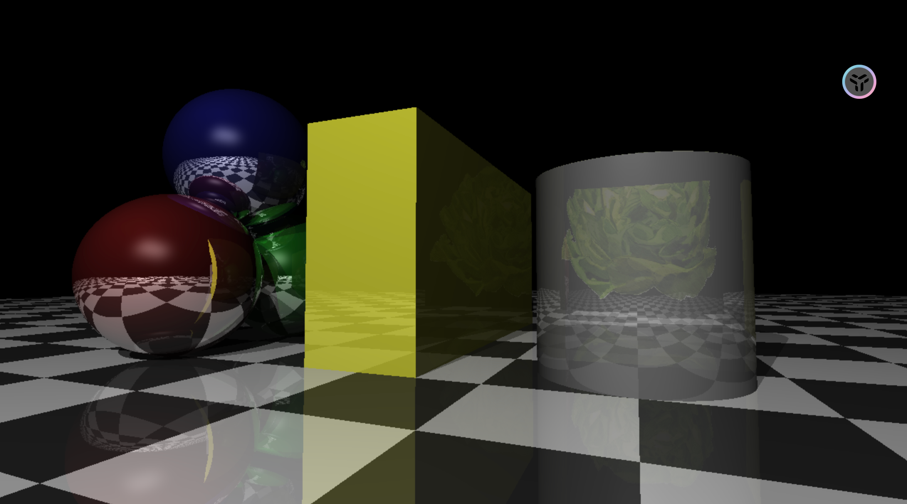

## Point Light （点光源）


## Material（布林冯模型）


> 将光分为3个部分，分别是环境光照(ambient lighting)，漫反射光照(diffuse reflection，高光(specular highlights)


[games101](https://www.bilibili.com/video/BV1X7411F744/?p=7&vd_source=b3b87210888ec87be647603921054a36)

- 觀測向量 v
- 表面法線 n
- 光照方向 l

### 漫反射分量

$$
    L_d = K_d \frac{E}{r^2} \max(0, \mathbf{\hat{n}} \cdot \mathbf{\hat{l}})
$$

$L_d$（扩散反射光强度，Diffuse Light Intensity）：这是物体接收到并反射出的光线的强度，对于每个表面点来讲，它是通过漫反射计算出来的光线强度。

$K_d$（漫反射係數嗎，Diffuse Reflectance Coefficient）：光到达物体表面后，能量会被吸收一部分（不同材质的物体对不同波长的光线吸收率是不一样的），剩下的会被反射出来，漫反射系数即定义了不被物体所吸收的光照颜色`
diffuseColor`，即物体表现出的颜色。

$\frac{E}{r^2}$(光照能量衰減係數)：光照能量衰减系数，抵达物体表面的能量与光源和着色点距离平方成反比。

$\max(0, \mathbf{\hat{n}} \cdot \mathbf{\hat{l}})$：表面着色点接收到的能量正比于$\mathbf{\hat{n}} \cdot \mathbf{\hat{l}}$。为了避免负值情况使用max做了最小值的限定


### 高光

$$
L_s = K_s \frac{E}{r^2} \max(0, \cos \theta)^p = K_s \frac{E}{r^2} \max(0, \mathbf{\hat{n}} \cdot \mathbf{\hat{h}})^p
$$

$L_s$ ：镜面反射光强度 (Specular Light Intensity)。这是物体表面由于镜面反射作用反射的光强度。

$K_s$ ：镜面反射系数 (Specular Reflectance Coefficient)。这是物体材质属性，表示物体表面对镜面反射光的反射能力。值越高，镜面反射效果越强。

$E$ ：光源光强 (Light Intensity)。这是来自光源的光的强度。

$r$ ：光源到表面点的距离 (Distance from Light Source to Surface Point)。光源与物体表面点之间的直线距离。公式中用 $r^2$ 是为了计算距离引起的光衰减。

$\cos \theta$ ：光源方向与镜面反射方向之间的余弦值。这是光源方向和镜面反射方向向量之间夹角的余弦。对于镜面反射，镜面反射方向 (R) 通常是视角方向的反射。

$\mathbf{\hat{n}} \cdot \mathbf{\hat{h}}$ ：单位表面法线向量 $\mathbf{\hat{n}}$ 与半程向量 $\mathbf{\hat{h}}$ 的点积。

$\mathbf{\hat{n}}$：表面法线向量 (Normal Vector)。这是垂直于表面的单位向量，表示表面方向。
$\mathbf{\hat{h}}$：半程向量 (Halfway Vector)。这是光源方向向量 $\mathbf{\hat{l}}$ 和观察方向向量 $\mathbf{\hat{v}}$ 的归一化和。公式为：
$$
\mathbf{\hat{h}} = \frac{\mathbf{\hat{l}} + \mathbf{\hat{v}}}{|\mathbf{\hat{l}} + \mathbf{\hat{v}}|}
$$
$p$ ：高光指数 (Shininess Coefficient)，也称为高光锐度指数或镜面反射指数 (Specular Exponent)。这个参数控制高光的锐利程度。值越大，镜面反射的高光区域越小越尖锐，值越小，高光区域越大越柔和。

$\max(0, \cos \theta)$ 和 $\max(0, \mathbf{\hat{n}} \cdot \mathbf{\hat{h}})$：这些函数确保了只有当光线方向与法线方向和半程向量方向成锐角时才有正的贡献，因为负值（光线在表面后方）不产生反射强度。


### 环境光

布林冯模型假设环境光是一个常量

$$
 L_a = K_a E_a
$$


### 总结

将三种光照作用效果叠加在一起，就可以得到近似的物理光照效果

$$
I  = I_{\text{ambient}} + I_{\text{diffuse}} + I_{\text{specular}} \\ = K_a E_a + K_d \frac{E}{r^2} \max(0, \mathbf{\hat{n}} \cdot \mathbf{\hat{l}}) + K_s \frac{E}{r^2} \max(0, \mathbf{\hat{n}} \cdot \mathbf{\hat{h}})^p
$$

### 反射

$$
\mathbf{R} = \mathbf{V} - 2 (\mathbf{V} \cdot \mathbf{N}) \mathbf{N}
$$

$\mathbf{V}$ 是入射光线的方向向量，应该是一个单位向量。
$\mathbf{N}$ 是反射面的法线向量，也是一个单位向量，通常指向介质外部。
$\mathbf{V} \cdot \mathbf{N}$ 表示向量的点积运算。
$\mathbf{R}$ 是反射光线的方向向量，也是一个单位向量。


## UV Space & Textures (uv展开 & 纹理)

> UV Unwrapping 是将 3D 模型的表面展开成一个平坦的二维表示，使得每一个3D表面都能准确地对应到2D纹理图像上的特定部分。
>
> 笛卡尔坐标系 -> 柱面坐标系
>
> [referece](https://zhuanlan.zhihu.com/p/369977849)


[推导过程](#平面交点推导)


> 球面映射
>   
> [reference][referenceLink2]

因为我们假定半径r为1，那么对于球面坐标系而言表示一个方向只需要两个变量，一个变量是极角 $\theta$ 相当于纬度，另一个是方位角 $\varphi$ 相当于经度，这两个变量的作用域分别是 $0 ≤θ≤ π$ 和 $ 0 ≤φ< 2π $，我们需要将其映射到uv坐标系的 $（0,1)$ 范围内。


1. 对于已知点 $(x, y, z)$ , 将其转换为球坐标系 $(r,θ,ϕ)$。
$$
\begin{cases}
r = \sqrt{x^2 + y^2 + z^2} \\
\theta = \arccos \left( \frac{z}{r} \right)  = \arcsin\left(\frac{\sqrt{x^2 + y^2}}{r}\right) = \arctan\left(\frac{\sqrt{x^2 + y^2}}{z}\right) \\
\varphi = \arccos\left(\frac{x}{r \sin \theta}\right) = \arcsin\left(\frac{y}{r \sin \theta}\right) = \arctan\left(\frac{y}{x}\right)
\end{cases}
$$

1. 参数化修正

实际应用中，UV坐标通常需要归一化到[0, 1]或[-1, 1]，因此：

$$
\begin{cases}
u = \frac{\varphi}{2\pi} = \frac{1}{2\pi} \arctan \left( \frac{y}{x} \right) \\
v = \frac{\theta}{\pi} = \frac{1}{\pi} \arccos \left( \frac{z}{r} \right)
\end{cases}
$$

3. 公式等价变形

等价变形后的公式为

$$
\begin{cases}
u = \arctan \left( \frac{\sqrt{x^2 + y^2}}{z} \right) \\
v = \arctan \left( \frac{y}{x} \right)
\end{cases}
$$

4. 归一化处理

$$
\begin{cases}
u_{\text{norm}} = 2 \cdot \dfrac{u}{\pi} - 1 \\
v_{\text{norm}} = 2 \cdot \dfrac{v}{\pi} - 1
\end{cases}
$$


- We already know the \((x, y, z)\) location of the point of intersection.
- And we can convert these into **cylindrical** coordinates using:

  $$
  \begin{aligned}
  u &= \tan^{-1}\left(\frac{y}{x}\right) \\
  v &= z
  \end{aligned}
  $$

- Note that in practice we use the $\texttt{atan2}$ function to compute \(\tan^{-1}\) because this will automatically handle the various edge cases.

- So the cylinder itself is quite easy, but what about the end caps?
- We defined these as planes, but then ignored any points more than 1 unit away from the origin giving a unit-disk shape.
- As we have already seen, computing \((u, v)\) for a plane is very easy.
- As the end-caps are unit disks, the task is even easier! Remember that we define objects in their own _local_ coordinate system, so the end cap will always be a disk with a radius of 1.
- Which means that \((u, v) = (x, y)\). It’s as simple as that!


### 图片 load

使用 sdl_image 库，将图片像素由 uv 转化为 xy 范围

#### 统一调整范围

u 和 v 的范围在 [-1, 1] 之间，我们需要将其调整到 [0, 1] 范围内。因此采取以下步骤：

$$ u' = \frac{u + 1}{2} $$
$$ v' = \frac{v + 1}{2} $$

#### 转换为像素坐标

将调整后的范围 [0, 1] 转换为图像宽度和高度范围 [0, m_xSize] 和 [0, m_ySize]。

$$ x = \left\lfloor u' \times m_xSize \right\rfloor $$
$$ y = \left\lfloor v' \times m_ySize \right\rfloor $$


[referenceLink2]: https://zhuanlan.zhihu.com/p/594429859

## Refractive Materials（折射材料）

> 折射材料（Refractive Materials）用来模拟现实世界中透明或半透明材料对光的折射行为。这类材料可以真实地再现如玻璃、水、宝石等在光线经过时产生的物理效果，使得渲染的图像更加逼真。
>
> 当光线从一种介质进入另一种介质时，光线的方向改变。这个变化可以用斯涅尔定律（Snell's Law）来描述。

斯涅尔定律：$$n_1 \sin \theta_1 = n_2 \sin \theta_2$$


1. 斯涅尔定律的基本形式
斯涅尔定律在标量形式下表示为：
$$
n_1 \sin \theta_1 = n_2 \sin \theta_2
$$
其中，$n_1$ 和 $n_2$ 是两种介质的折射率，$\theta_1$ 是入射角，$ \theta_2$ 是折射角。

1. 矢量的定义
设入射方向的单位矢量为 $\vec{v_{incident}}$，折射方向的单位矢量为 $\vec{v_{refract}}$，法向量为 $\vec{n}$。

1. 使用法向量表示入射和折射角的余弦
我们有以下关系：
$$
\begin{aligned}
\cos \theta_1 &= - \vec{n} \cdot \vec{v_{incident}} \\
\cos \theta_2 &= - \vec{n} \cdot \vec{v_{refract}}  
\end{aligned}
$$

1. 矢量形式的几何关系
将入射矢量分解为平行法向量和垂直法向量的部分:
$$
\vec{v_{incident}} = \vec{v}{\parallel} + \vec{v}{\perp}
$$
这里，$\vec{v}{\parallel}$ 是平行于法向量的部分，$\vec{v}{\perp}$ 是垂直于法向量的部分:

$$
\begin{aligned}
\vec{v}{\parallel} &= -(\vec{n} \cdot \vec{v_{incident}}) \vec{n} = -\cos \theta_1 \vec{n}\\
\vec{v}{\perp} &= \vec{v_{incident}} - \vec{v}{\parallel} = \vec{v_{incident}} + \cos \theta_1 \vec{n} 
\end{aligned}
$$

对于折射矢量，我们有类似的分解:
$$
\vec{v_{refract}} = \vec{v}'{\parallel} + \vec{v}'_{\perp}
$$

5. 利用斯涅尔定律和几何关系
根据斯涅尔定律：
$$
n_1 \sin \theta_1 = n_2 \sin \theta_2 \quad \Rightarrow \quad \sin \theta_2 = \frac{n_1}{n_2} \sin \theta_1
$$

垂直于法线的分量不变：
$$
\vec{v}'{\perp} = \frac{n_1}{n_2} \vec{v}{\perp}
$$

平行于法线的分量通过折射角的余弦变化：
$$
\cos \theta_2 = \sqrt{1 - \left( \frac{n_1}{n_2} \sin \theta_1 \right)^2}
$$

6. 总的折射矢量表示
折射矢量的总形式：
$$
\vec{v_{refract}} = \frac{n_1}{n_2} (\vec{v_{incident}} + \cos \theta_1 \vec{n}) - \cos \theta_2 \vec{n}
$$

将上面的分解代入并整理得到：
$$
\vec{v_{refract}} = \left( \frac{n_1}{n_2} \right) \vec{v_{incident}} + \left( \left( \frac{n_1}{n_2} \cos \theta_1 \right) - \cos \theta_2 \right) \vec{n}
$$

最终表达式
使用 $r = \frac{n_1}{n_2}$ 和 $c = \cos \theta_1 = - \vec{n} \cdot \vec{v_{incident}} $，并结合我们对 $\cos \theta_2$ 的计算：
$$
\vec{v_{refract}} = r \vec{v_{incident}} + \left( r c - \sqrt{1 - r^2(1 - c^2)} \right) \vec{n}
$$

这就是斯涅尔定律的矢量形式的推导过程。


## Ray Marching(光线行进)

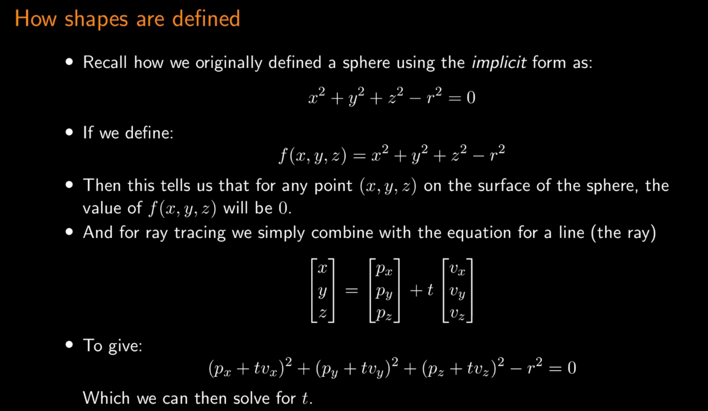

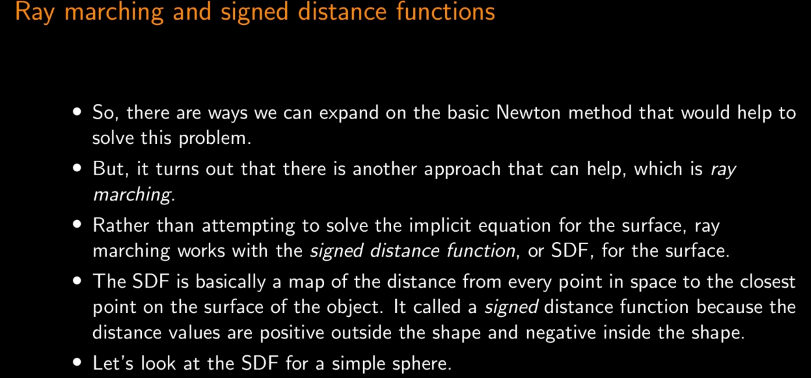

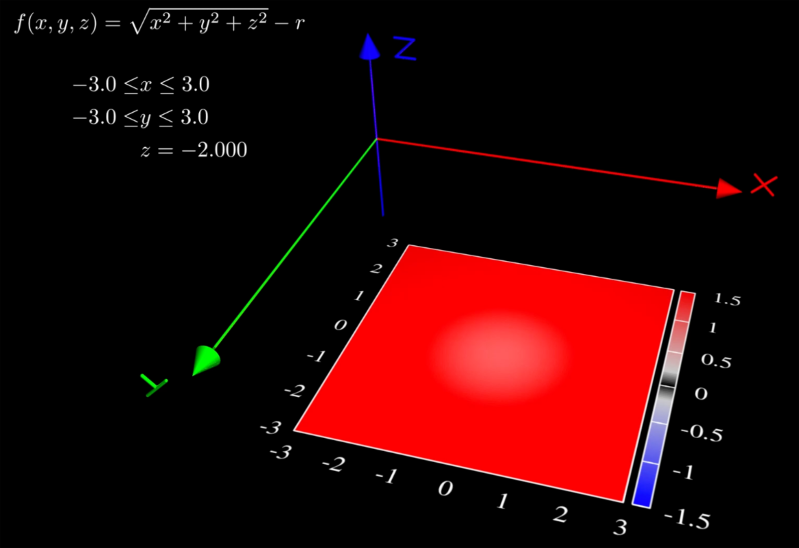

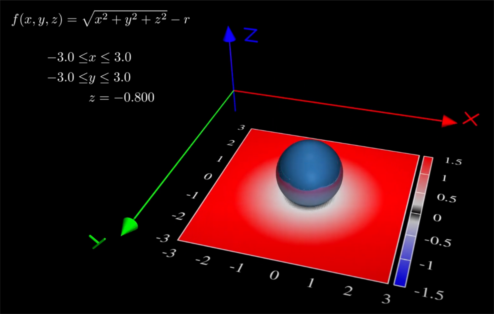

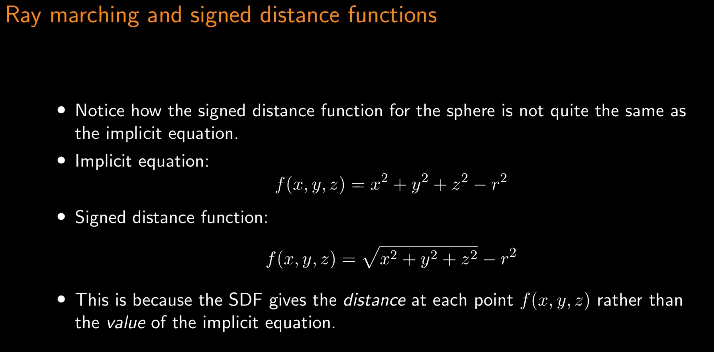

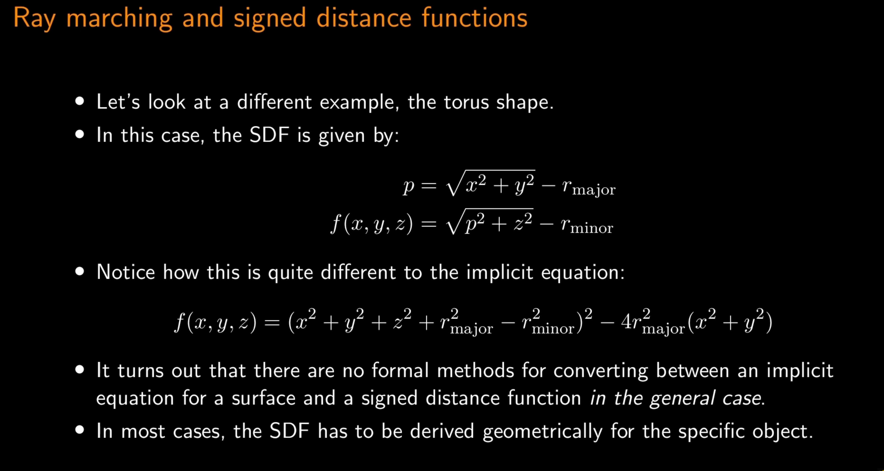

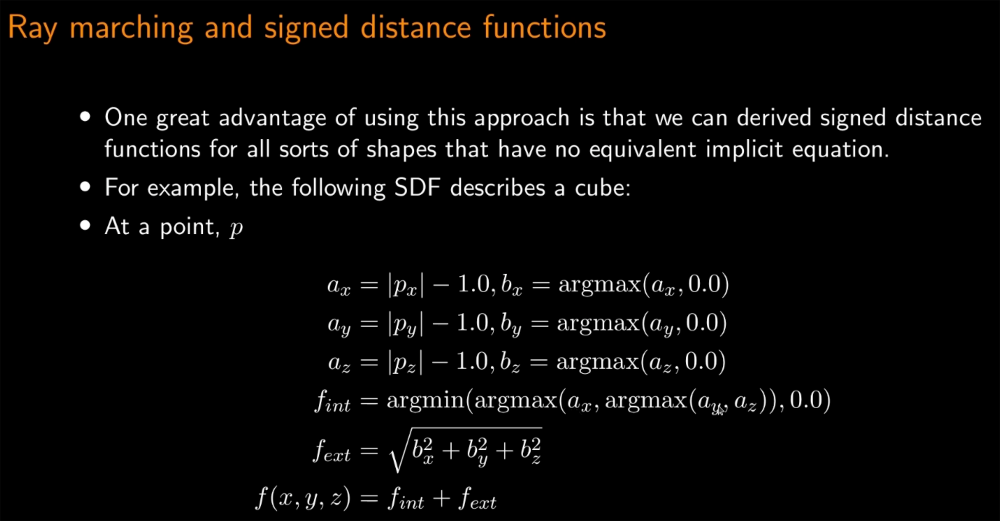

## Procedural Texture(程序纹理)

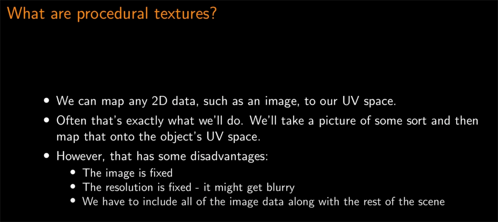

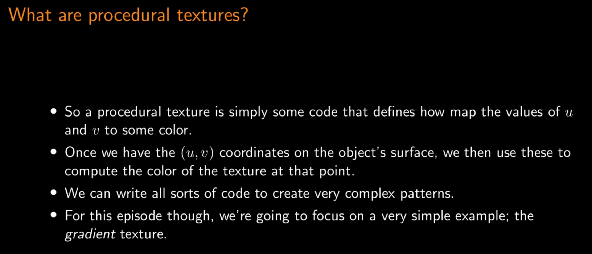

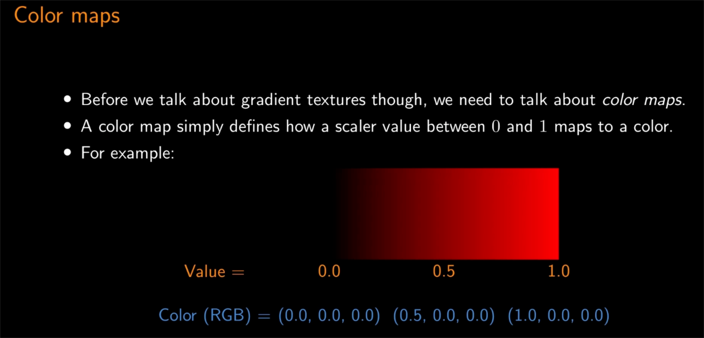

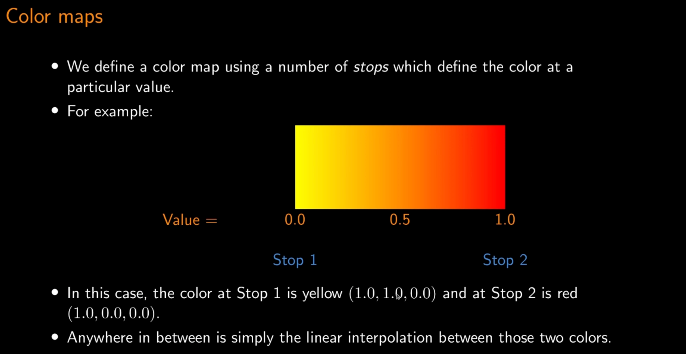

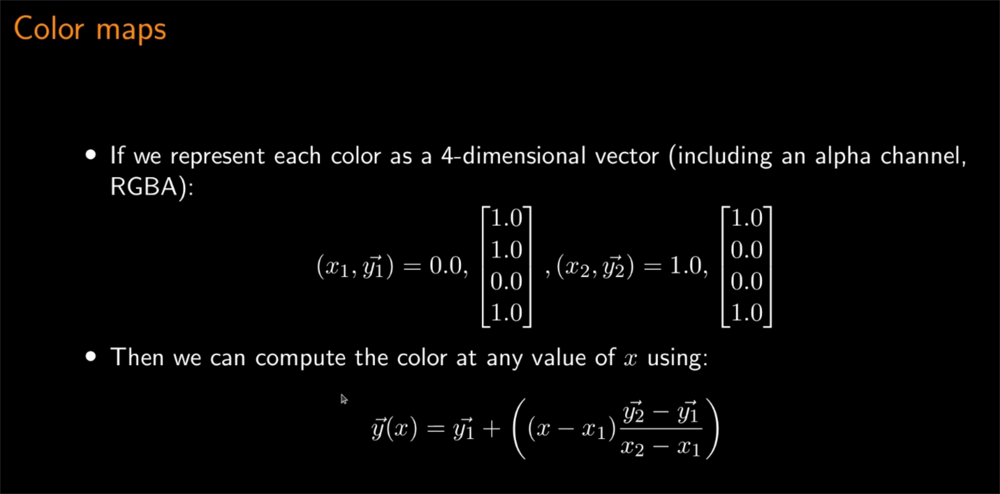

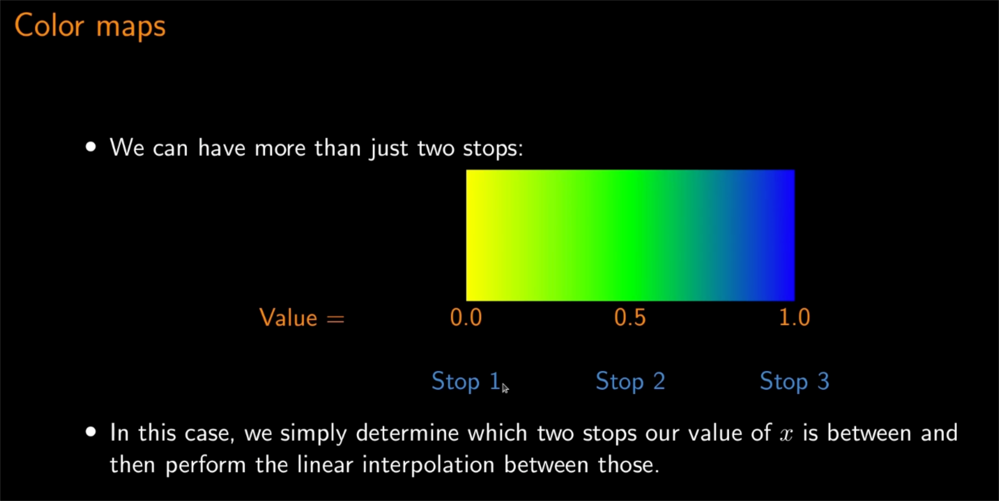

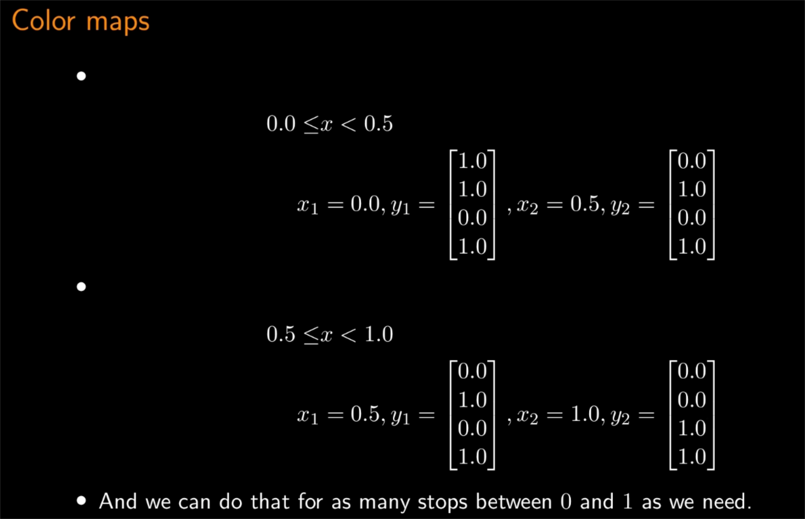